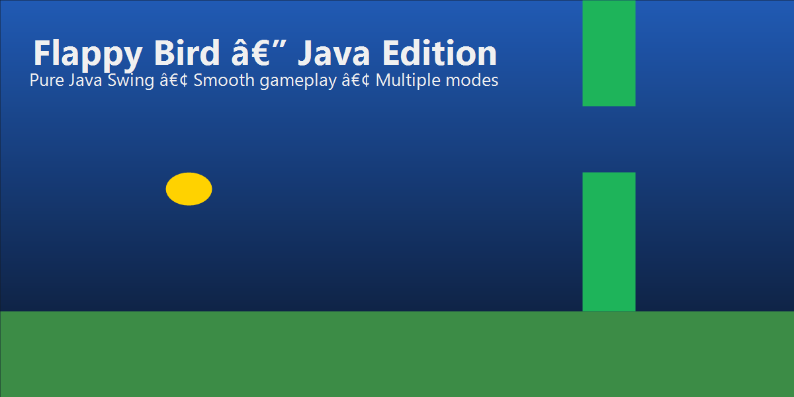

<div align="center">
  <h1>Flappy Bird — Java Edition</h1>
  <p>Fast, polished, and faithful remake built with pure Java Swing.</p>
  <p>
    
    
    
    
  </p>
</div>

<p align="center">
  
</p>
<p align="center"><em>Add a screenshot at <code>docs/preview.png</code> to show the game.</em></p>

## Highlights

<table>
  <tr>
    <td><strong>Arcade-accurate physics</strong><br/>Smooth gravity, jump timing, and responsive controls.</td>
    <td><strong>Polished visuals</strong><br/>Animated bird, scrolling ground, and dynamic backgrounds.</td>
    <td><strong>Immersive audio</strong><br/>Jump, score, collision, and menu sounds.</td>
  </tr>
  <tr>
    <td><strong>Multiple modes</strong><br/>Normal, Hard, and Night themes.</td>
    <td><strong>Score tracking</strong><br/>Live scoring with saved high score.</td>
    <td><strong>Pure Java</strong><br/>No external dependencies.</td>
  </tr>
</table>

## Game Modes

| Mode | Description |
|------|-------------|
| Normal | Classic pipe speed and gap size. |
| Hard | Faster pipes, tighter gaps, heavier gravity. |
| Night | Dark theme with stars and moon visuals. |

## Controls

| Key | Action |
|-----|--------|
| `SPACE` | Jump / Start |
| `P` | Pause / Resume |
| `R` | Restart |
| `M` | Main menu |
| `1` | Start normal game |
| `2` | Toggle hard mode |
| `3` | Toggle night mode |

## Getting Started

### Prerequisites
- Java JDK 8+
- Git (optional)

### Run Locally

```bash
git clone https://github.com/Amrut735/Flappy_Bird.git
cd Flappy_Bird/FlappyBird.java-main
javac FlappyBird.java
java FlappyBird
```

## Customization

Adjust gameplay and visuals by editing constants in `FlappyBird`:

```java
// Game difficulty
private static final int PIPE_GAP = 200;
private static final double GRAVITY = 0.5;
private static final int PIPE_SPEED = 5;

// Visual settings
private static final int BIRD_SIZE = 30;
private static final Color BIRD_COLOR = Color.YELLOW;
```

## Project Structure

```
FlappyBird.java-main/
├── FlappyBird.java
├── README.md
├── flappybird_highscore.dat
├── hit.wav
├── jump.wav
├── score.wav
└── select.wav
```

## Troubleshooting

**Won't compile**
- Make sure `javac` is on your PATH and Java 8+ is installed.

**No sound**
- Check system audio output and volume settings.

## License

MIT License. See `LICENSE` if present.

<div align="center">
  <strong>Enjoy playing! 🐦</strong>
</div>
